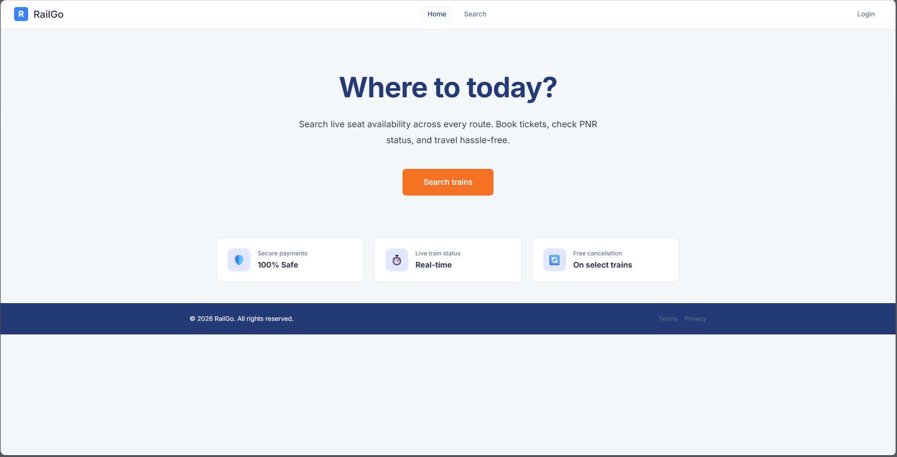
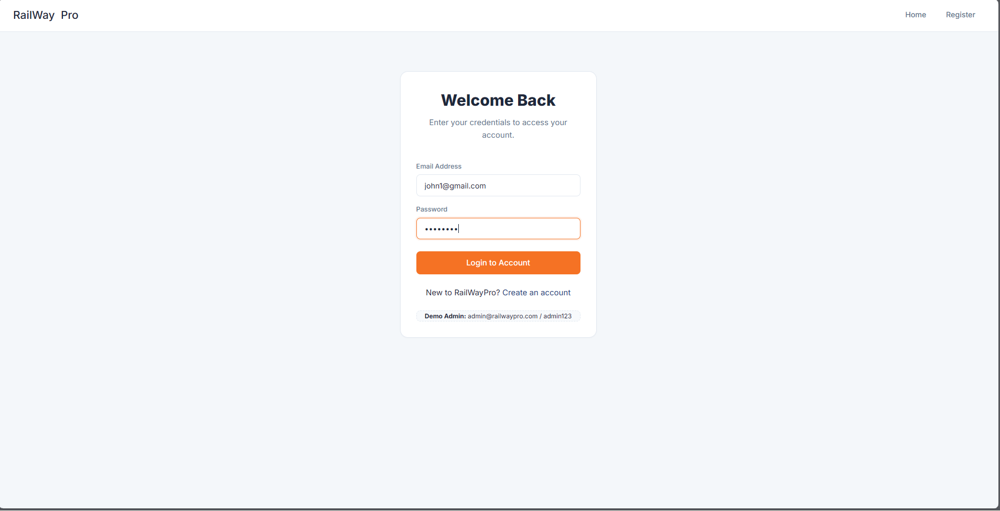
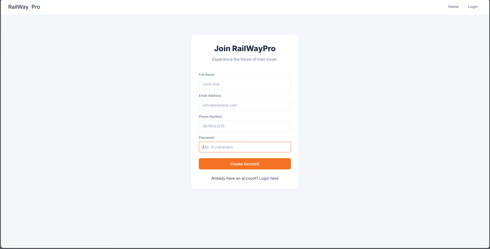
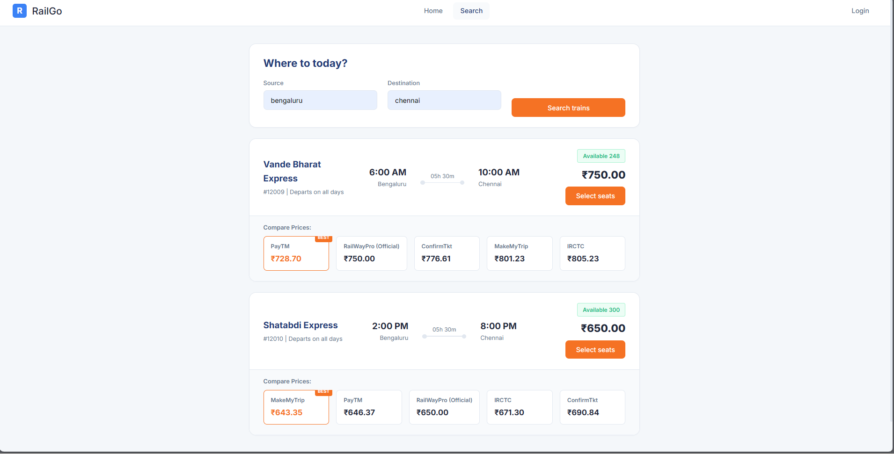
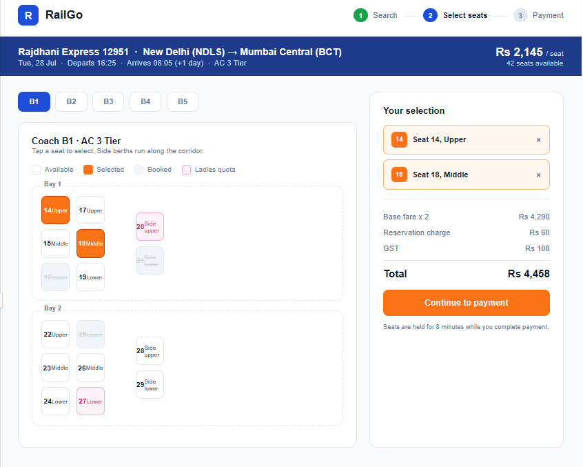
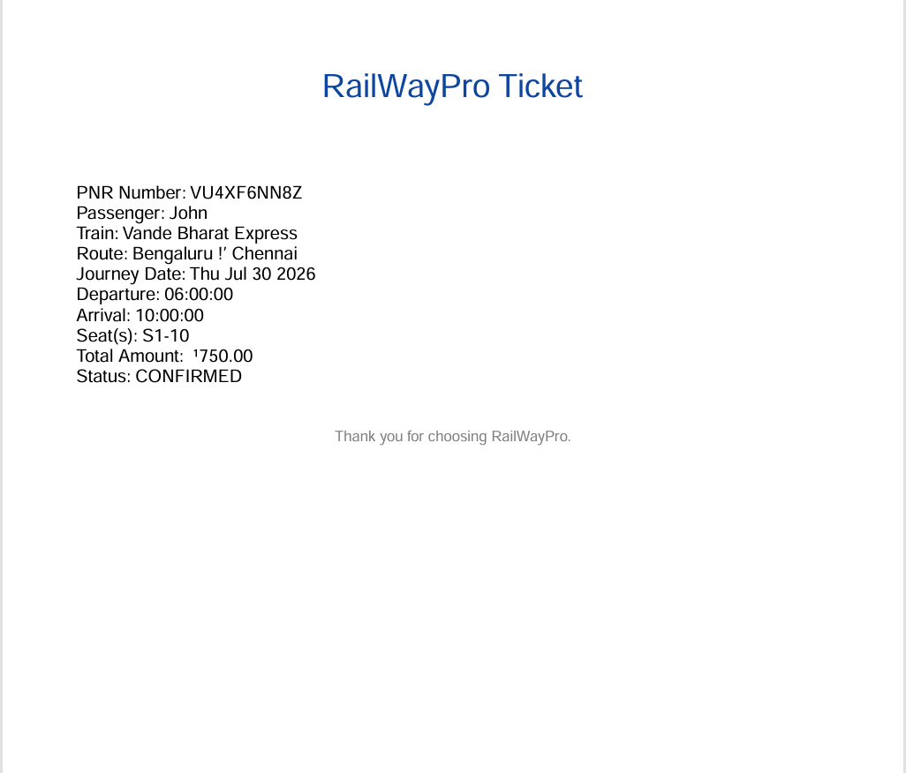

<div align="center">

# 🚆 Railway Ticket Booking System

### A Modern Full-Stack Railway Reservation Platform

Book train tickets, manage reservations, search trains, and generate downloadable tickets with a secure and responsive web application.


---

### 🌐 Live Demo
Coming Soon

### 📖 Documentation
Complete setup instructions are provided below.

</div>

---

# 📑 Table of Contents

- ✨ Features
- 🏗️ Project Architecture
- 🛠️ Tech Stack
- 📂 Project Structure
- 🚀 Getting Started
- ⚙️ Environment Variables
- 🗄️ Database Setup
- 🔑 API Endpoints
- 📸 Screenshots
- 🚀 Deployment
- 📈 Future Improvements
- 🤝 Contributing
- 📜 License

---

# ✨ Features

### 👤 User Module

- ✅ User Registration
- ✅ Secure Login using JWT Authentication
- ✅ Protected Routes
- ✅ Profile Authentication

---

### 🚆 Train Module

- 🔍 Search Trains
- 📅 View Train Details
- 🪑 Check Seat Availability
- 🚉 Source & Destination Search

---

### 🎟️ Booking Module

- Book Train Tickets
- Cancel Bookings
- View Booking History
- Generate PDF Ticket
- Automatic Seat Allocation

---

### 👨‍💼 Admin Module

- Add Trains
- Update Train Information
- Delete Trains
- Manage Bookings
- Monitor Users

---

### 🔒 Security

- JWT Authentication
- Password Hashing
- Route Protection
- Input Validation
- Error Handling Middleware

---

# 🏗️ Project Architecture

```
                   User
                     │
                     ▼
          Frontend (HTML/CSS/JS)
                     │
              REST API Calls
                     │
                     ▼
          Express.js Backend
                     │
          Authentication Layer
                     │
                     ▼
                 MySQL Database
```

---

# 🛠️ Tech Stack

## Frontend

- HTML5
- CSS3
- JavaScript

## Backend

- Node.js
- Express.js

## Database

- MySQL

## Authentication

- JSON Web Token (JWT)

## Utilities

- PDFKit
- bcrypt
- dotenv

---

# 📂 Project Structure

```
railway-ticket-booking/
│
├── backend/
│   ├── config/
│   ├── controllers/
│   ├── middleware/
│   ├── routes/
│   ├── utils/
│   ├── package.json
│   └── server.js
│
├── frontend/
│   ├── css/
│   ├── js/
│   ├── images/
│   └── index.html
│
├── database/
│   └── schema.sql
│
├── README.md
└── .gitignore
```

---

# 🚀 Getting Started

## 1️⃣ Clone Repository

```bash
git clone https://github.com/yourusername/railway-ticket-booking.git

cd railway-ticket-booking
```

---

## 2️⃣ Install Dependencies

```bash
cd backend

npm install
```

---

## 3️⃣ Configure Environment Variables

Create a `.env` file inside the backend folder.

```env
PORT=3000

DB_HOST=localhost

DB_USER=root

DB_PASS=your_password

DB_NAME=railwaydb

JWT_SECRET=your_secret_key
```

---

## 4️⃣ Create Database

Run

```sql
database/schema.sql
```

inside MySQL.

---

## 5️⃣ Start Server

```bash
npm start
```

or

```bash
npm run dev
```

---

Open

```
http://localhost:3000
```

---

# ⚙️ Environment Variables

| Variable | Description |
|----------|-------------|
| PORT | Server Port |
| DB_HOST | Database Host |
| DB_USER | Database Username |
| DB_PASS | Database Password |
| DB_NAME | Database Name |
| JWT_SECRET | Secret Key |

---

# 🗄️ Database

The project uses **MySQL**.

Tables include:

- Users
- Trains
- Bookings
- Seats
- Payments (Optional)

Import

```
database/schema.sql
```

before starting the application.

---

# 🔑 REST API

## Authentication

| Method | Endpoint |
|----------|------------|
| POST | /api/auth/register |
| POST | /api/auth/login |

---

## Train

| Method | Endpoint |
|----------|------------|
| GET | /api/trains |
| GET | /api/trains/:id |

---

## Booking

| Method | Endpoint |
|----------|------------|
| POST | /api/bookings |
| GET | /api/bookings/me |
| DELETE | /api/bookings/:id |

---

## Admin

| Method | Endpoint |
|----------|------------|
| POST | /api/admin/train |
| PUT | /api/admin/train/:id |
| DELETE | /api/admin/train/:id |

---

# 📸 Screenshots

## 🏠 Home Page



---

## 🔑 Login Page



---

## 👤 Create Account



---

## 🚆 Search Trains



---

## 🎟️ Booking Page



---

## 📄 Generated Ticket



# 🚀 Deployment

You can deploy using

### Backend

- Render
- Railway

### Frontend

- Vercel
- Netlify

### Database

- MySQL
- PlanetScale
- Railway MySQL

---

# 📈 Future Enhancements

- 💳 Online Payment Gateway
- 📱 Mobile Responsive UI
- 🔔 Email Notifications
- ⭐ Seat Preference
- 🌙 Dark Mode
- 📍 Live Train Status
- 📊 Admin Dashboard
- ❤️ Wishlist / Favorite Routes

---

# 🤝 Contributing

Contributions are always welcome.

1. Fork the repository

2. Create a feature branch

```bash
git checkout -b feature/NewFeature
```

3. Commit changes

```bash
git commit -m "Added New Feature"
```

4. Push changes

```bash
git push origin feature/NewFeature
```

5. Open a Pull Request

---

# 📜 License

This project is licensed under the **MIT License**.

---

<div align="center">

## ⭐ If you found this project helpful, please consider giving it a Star ⭐

Made with ❤️ by **Siddarth Naidu**

</div>
